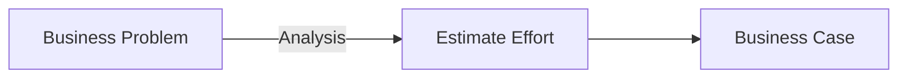
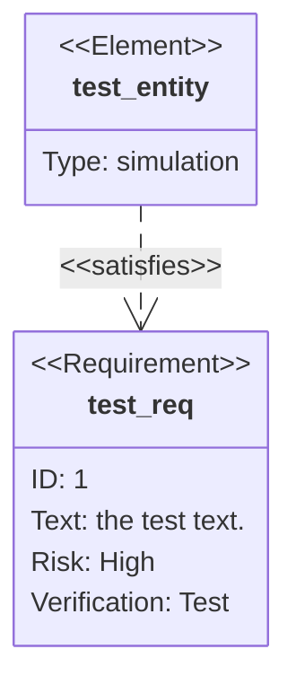

    

<!-- tabs:start -->

<!-- tab:Requirement -->
- **Current functionality**
- **Required functionality**
- **Scope of work**
- **Assumptions**

<!-- tab:Solution -->
 - solution approach
 - technical design
 - estimated effort
 - Solution 1
 - Solution 2

<!-- tab:Use Cases -->
 - use case 1
 - use case 2

<!-- tabs:end -->

