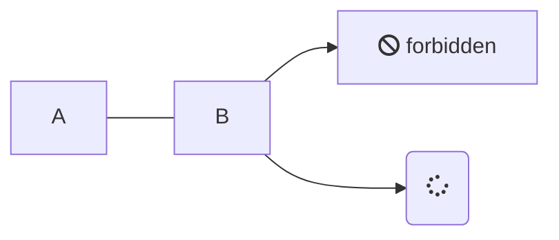

<!-- tabs:start -->

<!-- tab:English -->

```algorithm
% This quicksort algorithm is extracted from Chapter 7, Introduction to Algorithms (3rd edition)
\begin{algorithm}
\caption{Quicksort}
\begin{algorithmic}
\PROCEDURE{Quicksort}{$A, p, r$}
    \IF{$p < r$} 
        \STATE $q = $ \CALL{Partition}{$A, p, r$}
        \STATE \CALL{Quicksort}{$A, p, q - 1$}
        \STATE \CALL{Quicksort}{$A, q + 1, r$}
    \ENDIF
\ENDPROCEDURE
\PROCEDURE{Partition}{$A, p, r$}
    \STATE $x = A[r]$
    \STATE $i = p - 1$
    \FOR{$j = p$ \TO $r - 1$}
        \IF{$A[j] < x$}
            \STATE $i = i + 1$
            \STATE exchange
            $A[i]$ with $A[j]$
        \ENDIF
        \STATE exchange $A[i]$ with $A[r]$
    \ENDFOR
\ENDPROCEDURE
\end{algorithmic}
\end{algorithm}
```

<!-- tab:French -->

Bonjour!

<!-- tab:Italian -->

dgfhg <span class="tab-badge">New!</span>

<!-- tabs:end -->

<!-- panels:start -->
<!-- div:floating-cat -->

(...) - Awesome div wrapper

<!-- panels:end -->

<!-- select:start -->
<!-- select-menu-labels: Operating System -->

Common content can go here above the first heading in a section and be rendered for all selections!

#### --macOS--

macOS instructions here

#### --Linux--

Linux instructions here

<!-- select:end -->

# Default Slide

Here is what a default slide looks like.

There are two sections, and they both have 50% of the page width.


<!-- slide:break -->

# 

I have added:

```
<!-- slide:break -->
```

in my markdown to separate these two sections.





