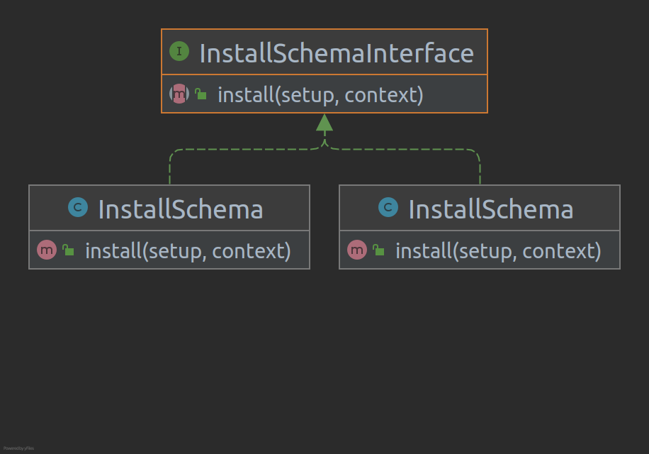

> [!NOTE]
> >Install script run once per module

- InstallSchema setup script is used for modifying database structure at the module’s first installation.

- Install method that will contain any CREATE TABLE or other SQL code that needs to be run to initialize a new module




```php
<?php

namespace Vendor\Module\Setup;
 
class InstallSchema implements \Magento\Framework\Setup\InstallSchemaInterface
{
    public function install(
        \Magento\Framework\Setup\SchemaSetupInterface $setup,
        \Magento\Framework\Setup\ModuleContextInterface $context)
    {
        $setup->startSetup();
 
        $table = $setup->getConnection()->newTable(
            $setup->getTable('custom_table')
        )->addColumn(
            'custom_id',
            \Magento\Framework\DB\Ddl\Table::TYPE_INTEGER,
            null,
            ['identity' => true, 'unsigned' => true, 'nullable' => false, 'primary' => true],
            'Custom Id'
        )->addColumn(
            'name',
            \Magento\Framework\DB\Ddl\Table::TYPE_TEXT,
            255,
            [],
            'Custom Name'
        )->setComment(
            'Custom Table'
        );
        $setup->getConnection()->createTable($table);
 
        $setup->endSetup();
}
```
### Directory Structure
```bash
Root Directory  
└─app
  └─code
     └─Vendor
        └─Module
          └─Setup
             │ InstallData.php
             │ InstallSchema.php
```

Magento 2 setup scripts are located in <module_dir>/Setup folder.
